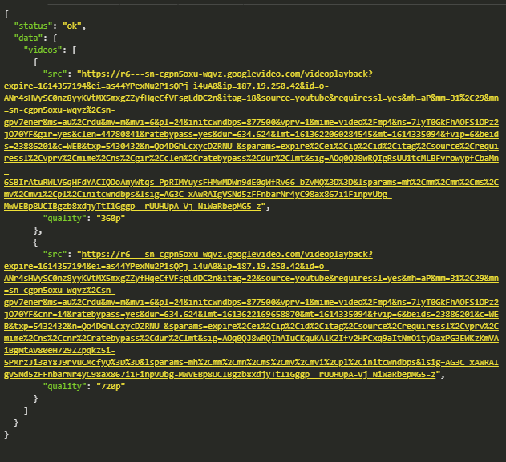

:warning: **Downloading copyrighted material is against [YouTube’s terms of service](https://www.youtube.com/static?template=terms)**



# :computer: Youtube Downloader API

### Start Application :fire:

``` nodemon src/app.js ```

### How to use :wrench:

````GET /api/v1/{videoid}```` 

### Packages :file_folder:
- Express | ```` npm install express --save ````
- fileGetContents | ````  npm install file-get-contents ````
- cors | ```` npm install cors ````
### Todos :clipboard:
- [x] Create project :heavy_check_mark:
- [x] Scraping :heavy_check_mark:
- [x] Final project :heavy_check_mark:
